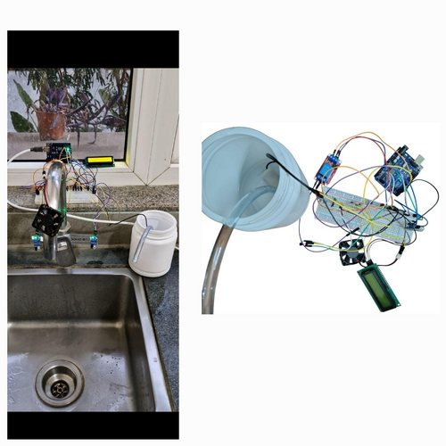

e# Smart Contactless Hand Hygiene System

This project provides a smart, contactless handwash dispensing system integrated with a hand dryer. The design is built using an Arduino UNO microcontroller and features IR sensors for hand detection, a relay-controlled pump for dispensing liquid soap, and a fan for drying hands. Real-time status updates are displayed on an I2C-based LCD screen.

---

## Features
- **Contactless Operation**: Ensures hygiene by eliminating physical contact.
- **Integrated Drying System**: Automatically activates a fan for drying hands after sanitization.
- **User-Friendly Interface**: Displays system status on a 16x2 I2C LCD screen.
- **Cost-Effective**: Uses easily available and affordable components.
- **Customizable**: Code and hardware can be adapted for various use cases.

---

## Components
1. Arduino UNO
2. 2 IR Proximity Sensors
3. 1 Channel Relay Module
4. Submersible Pump (Liquid Soap)
5. 5V DC Fan
6. 16x2 LCD with I2C module
7. 12V DC Adapter
8. Jumper wires
9. Breadboard

---

## How It Works
1. **Hand Detection**: IR sensors detect hand gestures for soap dispensing and drying.
2. **Dispensing Mechanism**: A relay module triggers a submersible pump to dispense liquid soap.
3. **Drying Mechanism**: A DC fan, activated via a transistor, dries hands.
4. **Display Messages**: The LCD shows instructions like "Place Hand," "Sanitizing," "Drying," and "Thank You."

---

## Installation & Usage
1. Assemble the components as per the circuit diagram in the project documentation.
2. Upload the Arduino code to the microcontroller.
3. Power the system using a 12V DC adapter.
4. Follow on-screen instructions for touchless hand hygiene.

---

## Visuals
### Photo of the System

### Demonstration Video
<video width="600" controls>
  <source src="Visuals/video.mp4" type="video/mp4">
[Watch the Video](Visuals/video.mp4)
</video>
